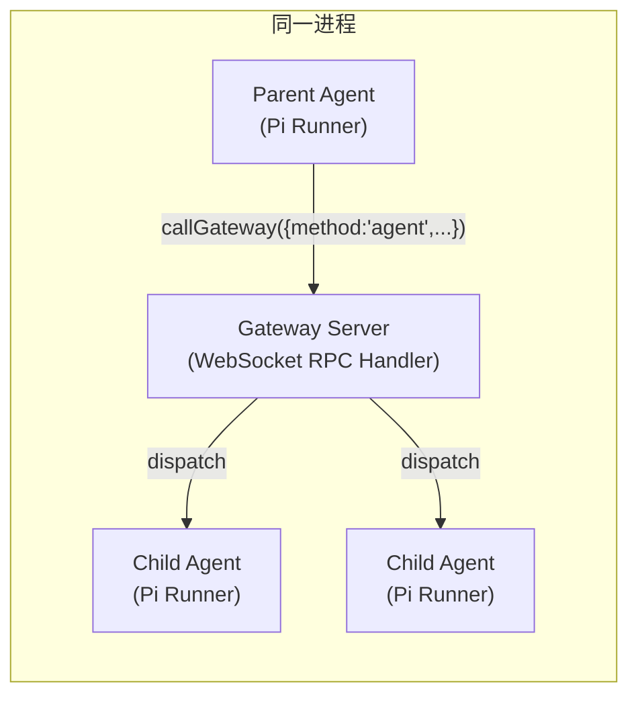

# OpenClaw Agent 与 Subagent 并发模型与通信机制

> 基于源码追踪分析，涵盖并发模型、进程/线程模型、IPC 通信路径、磁盘 I/O、上下文继承等核心机制。
>
> 分析基准：单进程部署（默认模式），Node 22+，Pi Embedded Runner。

---

## 一、进程/线程模型

### 1.1 单进程架构

所有 agent（main session）和 subagent 都运行在**同一个进程中**：

- **Gateway**：WebSocket 服务器 + RPC handler
- **Pi Embedded Runner**：每个 session 一个独立的 agent run handle（`ACTIVE_EMBEDDED_RUNS: Map<sessionId, EmbeddedPiQueueHandle>`）
- **子 agent 不是子进程**，没有 fork/exec，没有 IPC 管道
- 所有 "通信" 本质上是**同进程内的 RPC 分发**（`callGateway()` 发 WebSocket 消息 → 同一进程的 gateway handler 接收并 dispatch）



### 1.2 并发模型：双层队列

每个 agent 的消息处理经过**嵌套的双重队列**：

```
入站消息
    ↓
enqueueSession(sessionKey)    ← 同一 session 串行化（防止乱序）
    ↓
enqueueGlobal(lane)           ← 全局 lane 限流
    ↓
Pi Runner 处理
```

文件：`src/agents/pi-embedded-runner/run.ts:395-398`

#### 第一层：per-session 队列
- `enqueueSession(sessionKey)` 保证同一 session 的消息**顺序处理，不会并发**
- 每个 session 一个独立队列
- 防止同一个 session 的多个请求互相覆盖状态

#### 第二层：per-lane 全局队列
- `enqueueGlobal(CommandLane.Main)` 或 `enqueueGlobal(CommandLane.Subagent)`
- 在全局队列上做**最大并发数控制**（maxConcurrent）

---

## 二、并发数配置

### 2.1 默认值

文件：`src/config/agent-limits.ts`

| Lane | 常量 | 默认值 | 配置路径 |
|---|---|---|---|
| **main** （正常 chat.send） | `DEFAULT_AGENT_MAX_CONCURRENT` | **4** | `agents.defaults.maxConcurrent` |
| **subagent** （sessions_spawn） | `DEFAULT_SUBAGENT_MAX_CONCURRENT` | **8** | `agents.defaults.subagents.maxConcurrent` |

### 2.2 Lane 分配规则

文件：`src/agents/pi-embedded-runner/agent-runner-execution.ts:1359` + `src/agents/acp-spawn.ts:1396`

| 场景 | Lane | 说明 |
|---|---|---|
| 正常 chat.send / sessions_send | `CommandLane.Main` | 硬编码，默认 maxConcurrent=4 |
| sessions_spawn 子 agent | `CommandLane.Subagent` | `AGENT_LANE_SUBAGENT`="subagent"，默认 maxConcurrent=8 |
| Cron 任务 | `CommandLane.Cron` | 独立 lane |
| ACP session | 取决于配置 | runtime="acp" 时不同 |

### 2.3 生效时机

文件：`src/gateway/server-lanes.ts:6-13`

```typescript
function applyGatewayLaneConcurrency(cfg: OpenClawConfig): void {
  // 从配置中读取 lanes 设置，调用 setLaneMaxConcurrent()
  // 在 gateway 启动时执行一次
}
```

**重要**：maxConcurrent 控制的是**全局 lane 上同时运行的任务数**，不是 per-session 的。如果 main lane maxConcurrent=4，则所有 main lane 的 session 总共最多 4 个任务同时运行。

### 2.4 同一 session 不会并发

即使 maxConcurrent > 1，**同一个 session 也永远不会并发处理两个消息**：

- `enqueueSession()` 的 per-session 队列保证串行
- `ReplyRunAlreadyActiveError`（`reply-run-registry.ts`）作为额外防护：如果同一 session 已有一个 run 在运行，第二个请求会被拒绝而非排队

---

## 三、Subagent 生命周期与通信机制

### 3.1 通信总览

```
┌──────────────────────────────────────────────────────┐
│                       父 Agent                         │
│                                                        │
│  spawnSubagentDirect() → sessions_spawn 工具            │
│       │                                                │
│       ▼                                                │
│  prepareSubagentSessionContext()                        │
│  write sessions.json (×3)                               │
│  fork transcript (仅 fork mode)                          │
│       │                                                │
│       ▼                                                │
│  callGateway({method:"agent", sessionKey:childKey})     │
│       │ ←── 纯内存 WebSocket RPC ──→ Gateway           │
│       │                                  │              │
│       ▼                                  ▼              │
│  agent.wait RPC (等待完成)              子 Agent 启动    │
│       │                                  │              │
│       │                          写 transcript (持续)   │
│       │                                  │              │
│       │                          子完成 ──────────→      │
│       │                                  │  announce     │
│       │◄─────────────────────────────────── 流           │
│       │                                              │
│  announce deliver → queueEmbeddedPiMessage (内存)     │
│  → 父处理 → 写父 transcript                          │
└──────────────────────────────────────────────────────┘
```

### 3.2 通信路径（分阶段）

#### 阶段 1：Spawn（父 → 子创建）

| 步骤 | 操作 | I/O | 说明 |
|---|---|---|---|
| 1 | `resolveSubagentContextMode()` | 无 | 决定 context 模式 |
| 2 | `updateSessionStore()` ×3 | **写 sessions.json** | 创建 session 条目 + lineage + model |
| 3 | `prepareSubagentSessionContext()` | 取决于 mode | isolated：无；fork：读/写 transcript |
| 4 | `materializeSubagentAttachments()` | **写附件文件** | 如果有 attachments |
| 5 | `callGateway({method:"agent", ...})` | **无（RPC）** | gateway dispatch 到子 session 的 Pi runner |

#### 阶段 2：运行中（子独立执行）

| 方向 | 路径 | I/O |
|---|---|---|
| 子 → 子自己的 transcript | `SessionManager.appendMessage()` | **写 transcript JSONL**（每条消息） |
| 子 → 子自己的 sessions.json | 状态更新 | **写 sessions.json** |
| 父 → 子控制 | **无**（spawn and forget） | — |

**注意**：spawn 后父 agent 和子 agent 的对话是完全独立的。父不会在子运行期间主动干预（除非父在 spawn 后做了额外的事情，比如在 ACP 模式下）。

#### 阶段 3：完成通知（子 → 父）

子 agent 完成后，由 announce 流程将结果投递给父。有两种路径：

**默认路径（嵌入式 Pi Runner，非 ACP）：**

```
子完成 → runSubagentAnnounceFlow()
    ↓
waitForSubagentRunOutcome() → agent.wait RPC（无 I/O，长轮询）
    ↓
readSubagentOutput() → chat.history RPC（网关读 transcript JSONL）
    ↓
buildCompactAnnounceStatsLine() → loadSessionStore() → 同步读 sessions.json（1~4次）
    ↓
loadRequesterSessionEntry() → loadSessionStore() → 同步读 sessions.json
    ↓
sendSubagentAnnounceDirectly()
  → queueEmbeddedPiMessage() → **纯内存，丢入父的 active run handle**
  → 父 Pi runner 处理 → 写父 transcript
```

**ACP 流模式（`sessions_spawn(runtime:"acp")`）：**

```
子 ACP harness 输出 → acp-spawn-parent-stream.ts
    ↓
onAgentEvent() → 纯内存事件总线
    ↓
enqueueSystemEvent() → 纯内存队列
```

#### 阶段 4：清理

| 操作 | I/O |
|---|---|
| `sessions.delete` RPC → 网关侧 | **删 transcript 文件 + 删 sessions.json 条目** |
| `fs.rm(attachmentDir)` | **删附件目录** |

### 3.3 通信路径总结

| 路径 | 方向 | 机制 | I/O |
|---|---|---|---|
| `callGateway({method:"agent", ...})` | 父→子 / 子→父 | WebSocket RPC（同进程） | 无（内存消息） |
| `queueEmbeddedPiMessage()` | announce 投递 | 全局 Map + `handle.queueMessage()` | **纯内存** |
| `onAgentEvent()` | ACP stream | 内存发布/订阅 | **纯内存** |
| `enqueueSystemEvent()` | ACP stream | 内存 Map | **纯内存** |
| `chat.history` RPC | 读取对话历史 | WebSocket RPC，网关 handler 读文件 | **读 transcript JSONL** |
| `loadSessionStore()` | 读取 session store | 同步文件读 | **读 sessions.json** |
| `updateSessionStore()` | 更新 session store | 原子写入 | **写 sessions.json** |
| `readSubagentOutput()` | 读取子结果 | 调用 chat.history RPC | **读 transcript** |

---

## 四、磁盘 I/O 深度分析

### 4.1 Transcript 文件

- 格式：JSONL（每行一个 JSON 消息）
- 路径：`<workspace>/sessions/<agentId>/<sessionId>/transcript.session.jsonl`
- **每一条 agent 消息（user/assistant/tool）都会 append 到该文件**
- 读取：通过 `chat.history` RPC → `readRecentSessionMessagesAsync()` → `fs.promises.open()` + `read()`

### 4.2 Sessions.json 文件

- 路径：`<workspace>/sessions/<agentId>/sessions.json`
- 格式：JSON 对象，key 为 sessionKey，value 为 `SessionEntry`
- **写入**：`updateSessionStore()` → `saveSessionStoreUnlocked()` → `writeSessionStoreAtomic()`（temp + rename + fsync）
  - 写操作有 per-storePath 的 mutex 队列（`runExclusiveSessionStoreWrite`）
- **读取**：`loadSessionStore()` → `fs.readFileSync()`（有 TTL 缓存，默认 45 秒）
  - 缓存命中条件：mtime 和 size 未变
  - Windows 有 3 次重试（解决并发读写时的空文件问题）
- **优化**：`saveSessionStoreUnlocked()` 中会检查序列化内容是否真的变了，不变则跳过写

```typescript
// store.ts 中的写入优化
if (getSerializedSessionStore(storePath) === json) {
  updateSessionStoreWriteCaches({ storePath, store, serialized: json });
  return; // ← 跳过磁盘写入
}
```

### 4.3 完整 I/O 对比：sessions_send vs sessions_spawn

以下对比基于**单次任务**，无附件，`context:"isolated"`：

| 阶段 | sessions_send 到已有 session | sessions_spawn |
|---|---|---|
| 前置解析 | `sessions.resolve` RPC → 读 sessions.json | 同上 |
| **创建 session** | **不需要** | **写 sessions.json ×3** ← 核心差异 |
| **Fork 父 transcript** | **不需要** | **不需要**（isolated 模式跳过）|
| 注入 system prompt | 无 I/O | 无 I/O（纯内存拼接） |
| **执行中写 transcript** | ~N 次（相同） | ~N 次（相同） |
| 读结果 | `chat.history` RPC → 读 transcript | `chat.history` RPC → 读 transcript（相同） |
| **读 token 统计** | **不需要** | `loadSessionStore()` → 读 sessions.json 1~4 次 |
| 投递回父 | A2A 流 agent RPC | `queueEmbeddedPiMessage()`（内存）|
| 写父 transcript | ✅ 相同 | ✅ 相同 |
| **总计 sessions.json 写** | ~2 次 | ~5 次（+3 次 spawn 阶段） |
| **总计 sessions.json 读** | ~2 次（resolve + chat.history） | ~5 次（chat.history 同 + announce 额外） |

**并发 N 个任务的关键瓶颈**：所有 `sessions.json` 写入走串行 mutex，sessions_spawn 负载约 2.5 倍于 sessions_send。

### 4.4 缓存行为

| 缓存 | 位置 | TTL | 说明 |
|---|---|---|---|
| `SESSION_STORE_CACHE` | `store-cache.ts` | 45s（可配置） | 缓存 sessions.json 的反序列化对象 |
| `SESSION_STORE_SERIALIZED_CACHE` | `store-cache.ts` | 无 TTL（内存 Map） | 缓存序列化后的字符串，用于比对是否变化 |
| `getFileStatSnapshot()` | `cache-utils.ts` | 可选 | 每次 loadSessionStore 都 stat（即使缓存命中） |

---

## 五、上下文继承机制

### 5.1 context 模式总览

`sessions_spawn` 支持三种 context 模式：

| 模式 | 说明 | 是否读父 transcript | 子是否看到父历史 |
|---|---|---|---|
| `"isolated"` | **独立会话**（默认） | ❌ | ❌ |
| `"fork"` | **从父会话 fork** | ✅ 读全文 + 写分支文件 | ✅ 子继承父历史消息 |
| 无参（默认） | 等效于 `"isolated"` | ❌ | ❌ |

### 5.2 Default 解析逻辑

文件：`subagent-spawn.ts:550-571`

```typescript
function resolveSubagentContextMode(params) {
  if (显式传了 "fork" 或 "isolated") → 用指定的
  if (不是 thread 通道) → 返回 "isolated"  
  if (thread 通道) → 查 channel 配置的 defaultSpawnContext
  // 绝大多数场景 → "isolated"
}
```

### 5.3 Isolated 模式下子的 System Prompt

子 agent 收到的 system prompt（`buildSubagentSystemPrompt()`）只包含：

```
# Subagent Context

You are a **subagent** spawned by the main agent for a specific task.

## Your Role
- You were created to handle: {{TASK_DESCRIPTION}}
- Complete this task. That's your entire purpose.

## Rules
1. Stay focused
2. Complete the task
3. Don't initiate
4. Be ephemeral
...

## Session Context
- Requester session: {{PARENT_SESSION_KEY}}     ← 仅仅是 key 名字
- Your session: {{CHILD_SESSION_KEY}}           ← 子自己的 key
```

**不包含：** 父的对话历史、父的文件内容、父的思维链、父的工作区文件。子只知道 `task` 参数中明确传入的信息。

### 5.4 Fork 模式做了什么

```typescript
// session-fork.runtime.ts
readForkSourceTranscript(parentSessionFile)  → 读父 transcript 全文
writeBranchedSession(forkedSessionFile)       → 写子 transcript（从父分支）
```

fork 模式下，子 session 的 transcript 文件**包含父到 fork 点为止的所有历史消息**，子可以在对话窗口看到父之前说过的话。

---

## 六、关键文件索引

| 文件 | 内容 |
|---|---|
| `src/agents/subagent-spawn.ts` | spawn 主流程 & context 解析 |
| `src/agents/subagent-system-prompt.ts` | 子 agent system prompt 构建 |
| `src/agents/subagent-announce-output.ts` | 完成后的输出读取 |
| `src/agents/subagent-announce-delivery.ts` | 结果投递回父 |
| `src/agents/subagent-attachments.ts` | 附件落地 |
| `src/agents/pi-embedded-runner/run.ts` | 嵌套队列（per-session + per-lane）|
| `src/agents/pi-embedded-runner/command-queue.ts` | Lane 队列 + maxConcurrent |
| `src/gateway/server-lanes.ts` | Lane 配置 |
| `src/gateway/server-methods/chat.ts` | chat.history（读 transcript）|
| `src/gateway/session-utils.fs.ts` | `readRecentSessionMessagesAsync()` |
| `src/config/agent-limits.ts` | 默认并发数常量 |
| `src/config/sessions/store.ts` | `saveSessionStoreUnlocked()` / `writeSessionStoreAtomic()` |
| `src/config/sessions/store-load.ts` | `loadSessionStore()` + `fs.readFileSync` |
| `src/config/sessions/store-cache.ts` | Session store TTL 缓存 |
| `src/auto-reply/reply/session-fork.runtime.ts` | Fork transcript 读写 |
| `src/agents/tools/sessions-send-tool.ts` | sessions_send 工具（对比基准）|
| `src/agents/tools/sessions-send-tool.a2a.ts` | A2A 流 |
| `src/agents/run-wait.ts` | `readLatestAssistantReplySnapshot()` |
| `src/gateway/call.ts` | `callGateway()` WebSocket RPC |
| `src/infra/system-events.ts` | `enqueueSystemEvent()` 内存队列 |

---

## 七、关键结论

1. **同一进程内运行**：所有 agent/subagent 共享一个进程，没有子进程/容器/VM 隔离（除非配置 sandbox）。

2. **同一 session 不会并发**：per-session 队列 + ReplyRunAlreadyActiveError 双重保证。

3. **并发上限由 lane maxConcurrent 控制**：main lane 默认 4，subagent lane 默认 8。

4. **通信以内存操作为主**：`callGateway`、`queueEmbeddedPiMessage`、`onAgentEvent`、`enqueueSystemEvent` 都是纯内存。

5. **转录 I/O 仅用于持久化和读取结果**：每次 agent 写一条旧日志，完成时 reader 读一次文件。

6. **sessions.json 的串行写入是并发瓶颈**：所有并发任务的写入走同一个 mutex queue。

7. **默认 isolated 模式**：子 agent 不继承任何父的对话历史，只能通过 `task` 参数和 `attachments` 获得信息。
